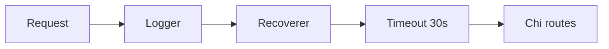

# Go User Management REST API — Implementation Plan

## Scope

Greenfield project in [`d:\TestCursorGo`](d:\TestCursorGo): four Go source files at the module root, plus `Dockerfile`, `docker-compose.yml`, and a PostgreSQL init script so the `users` table exists on first startup.

**Endpoints (as specified):**

- `POST /users` — create user (JSON body).
- `GET /users` — list all users.

No separate `cmd/` package unless you later split binaries; keeping everything at repo root matches your requested layout (`main.go` at entry).

## Module and dependencies

Initialize the module (pick a module path; replace if you use a real VCS path):

```bash
cd d:\TestCursorGo
go mod init github.com/yourorg/usermgmt
```

Install dependencies:

```bash
go get github.com/go-chi/chi/v5@latest
go get github.com/jackc/pgx/v5@latest
go get github.com/jackc/pgx/v5/pgxpool@latest
```

(`pgxpool` is part of the same module as `pgx/v5`; one `go get` on `jackc/pgx/v5` often suffices, but explicitly pulling `pgxpool` keeps intent clear.)

## File responsibilities

| File | Role |
|------|------|
| [`models.go`](d:\TestCursorGo\models.go) | `User` (with `json` tags), optional request DTO for create (e.g. `CreateUserRequest`) to avoid binding DB fields like `ID` from clients. |
| [`repository.go`](d:\TestCursorGo\repository.go) | **`UserRepository` interface** with `Create(ctx, ...)` and `List(ctx)` (return `[]User` or pointers). **`PostgresRepo`** struct holding `*pgxpool.Pool`; methods satisfy the interface implicitly (no `implements` keyword — idiomatic Go). Constructor: `NewPostgresRepo(pool *pgxpool.Pool) *PostgresRepo`. |
| [`handler.go`](d:\TestCursorGo\handler.go) | **`Handler`** struct with `repo UserRepository` (interface type — enables testing/mocking). HTTP methods: `CreateUser`, `ListUsers`; both take `http.ResponseWriter`, `*http.Request`; use `r.Context()` and pass `context.Context` to the repository. JSON via `encoding/json`; appropriate status codes (`201` create, `200` list, `400` bad input, `500` on internal errors). |
| [`main.go`](d:\TestCursorGo\main.go) | Load config (e.g. `DATABASE_URL` from env). **`pgxpool.NewWithConfig`** with `context.Background()` (or a short startup timeout). Defer `pool.Close()`. Construct `PostgresRepo`, then `Handler{repo: ...}`. **Chi**: `chi.NewRouter()`, chain **`middleware.Logger`**, **`middleware.Recoverer`**, **`middleware.Timeout(30*time.Second)`** (from `chi/middleware`), then `r.Post("/users", h.CreateUser)`, `r.Get("/users", h.ListUsers)`. `http.Server` with `Addr` from env (e.g. `:8080`) and `Handler: r`. `ListenAndServe` with graceful consideration optional (minimalist: plain `ListenAndServe` is fine). |

## Database schema

Single table, e.g. `users` with `id SERIAL PRIMARY KEY`, `name` (or `email` + `name` — minimal: `name` text and `created_at` timestamptz optional). Align column names with `User` struct `db` tags if you use struct scanning with pgx named/positional mapping.

**Init SQL** (e.g. [`scripts/init.sql`](d:\TestCursorGo\scripts\init.sql) or [`docker/postgres/init.sql`](d:\TestCursorGo\docker\postgres\init.sql)): `CREATE TABLE IF NOT EXISTS users (...)`.

**docker-compose**: mount init SQL into `postgres:15-alpine` via `./path/to/init.sql:/docker-entrypoint-initdb.d/01-init.sql` so the DB is ready before the app connects.

## Middleware order (recommended)



Apply timeout **after** recoverer so panics are still recovered; logger first to log all requests.

## Docker

**Multi-stage [`Dockerfile`](d:\TestCursorGo\Dockerfile):**

1. **Build stage**: `FROM golang:alpine` — install CA certs if needed for `go mod download`, `WORKDIR /app`, copy `go.mod` / `go.sum` then source, `CGO_ENABLED=0 go build -o /server .` (static binary).
2. **Runtime**: `FROM alpine:latest` — copy binary only; non-root user optional for hardening; `EXPOSE 8080`; `CMD ["/server"]`.

**[`docker-compose.yml`](d:\TestCursorGo\docker-compose.yml):**

- Service `db`: `postgres:15-alpine`, env `POSTGRES_USER`, `POSTGRES_PASSWORD`, `POSTGRES_DB`, volume for init SQL, healthcheck optional (`pg_isready`).
- Service `app`: `build: .`, `depends_on: db`, env `DATABASE_URL=postgres://user:pass@db:5432/dbname?sslmode=disable`, `ports: "8080:8080"`.

## Error handling and context

- Every DB and handler path: `if err != nil` with logging or `http.Error` / JSON error body (minimalist: `http.Error` is enough).
- All repository methods: first parameter `ctx context.Context`; handlers pass `r.Context()`.

## What will not be included (unless you ask)

- JWT auth, pagination, OpenAPI spec, separate `internal/` layout (your spec is flat four files).
- Full CRUD (update/delete): you listed only create and list; the plan matches that.

## Verification (after implementation)

- `go build ./...` and `go vet ./...` locally.
- `docker compose up --build` and curl `POST /users` / `GET /users`.
