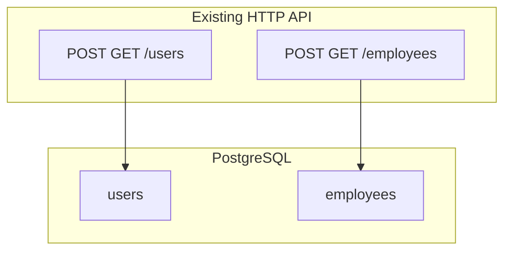

# Extension plan: Employees (API recap) + React frontend

**Important:** The original plan file [`.cursor/plans/go_user_management_api_c924673b.plan.md`](c:\Users\user\source\repos\TestCursorGo\TestCursorGo\.cursor\plans\go_user_management_api_c924673b.plan.md) is **not modified** by this work. Treat that file as the historical “Phase 1 — Go users API” spec. This document **adds** employees to the narrative (matching code you already have) and **adds** a new phase for the React UI.

---

## Part A — Original plan (reference only)

Phase 1 remains as documented in the linked plan: chi + pgxpool + Docker + `POST/GET /users`. No edits to that file are required for the frontend effort.

---

## Part B — Employees API (already implemented in repo)

The backend already extends beyond the original plan. Align documentation and future work with the current code:

| Method | Path | Body / notes |
|--------|------|----------------|
| POST | `/employees` | JSON `{"name","email"}` — **201** on success; **409** if email duplicates (unique constraint) |
| GET | `/employees` | JSON array of employees |

Relevant files: [`main.go`](c:\Users\user\source\repos\TestCursorGo\TestCursorGo\main.go) (routes), [`handler.go`](c:\Users\user\source\repos\TestCursorGo\TestCursorGo\handler.go), [`models.go`](c:\Users\user\source\repos\TestCursorGo\TestCursorGo\models.go), [`repository.go`](c:\Users\user\source\repos\TestCursorGo\TestCursorGo\repository.go), [`schema.go`](c:\Users\user\source\repos\TestCursorGo\TestCursorGo\schema.go), [`scripts/init.sql`](c:\Users\user\source\repos\TestCursorGo\TestCursorGo\scripts\init.sql).

---

## Part C — React frontend (new work)

**Goal:** A small SPA to list and create **users** and **employees** against the existing API.

**Stack:** Vite + React + TypeScript under a new top-level folder, e.g. [`frontend/`](c:\Users\user\source\repos\TestCursorGo\TestCursorGo\frontend) (monorepo next to Go sources). Use `fetch` (or a thin wrapper) — no need for a heavy data layer for two resources.

**UX (minimal, clear):**

- **Users:** form (name) + submit; table or list showing `id`, `name`, `created_at`; refresh after create.
- **Employees:** form (name, email) + submit; list/table with `id`, `name`, `email`, `created_at`; show API error text on **409** (duplicate email) vs generic errors.

**Configuration:** `VITE_API_BASE_URL` (e.g. `http://localhost:8080`) read in the client for all requests.

**CORS (required):** Browsers will block calls from `http://localhost:5173` (Vite) to `http://localhost:8080` unless the Go server sends CORS headers. Add CORS middleware on the chi router in [`main.go`](c:\Users\user\source\repos\TestCursorGo\TestCursorGo\main.go) (e.g. `github.com/go-chi/cors` or manual `Access-Control-Allow-*` for dev origins). Allow `GET`, `POST`, `OPTIONS`, and `Content-Type` header.

**Docker (optional follow-up):** Extend [`docker-compose.yml`](c:\Users\user\source\repos\TestCursorGo\TestCursorGo\docker-compose.yml) with a `frontend` service that builds the static assets or runs `npm run dev` with the API URL pointing at `app:8080` — only if you want one-command full stack; local `npm run dev` + API on 8080 is enough for development.

**Verification:**

- `cd frontend && npm run build` succeeds.
- With API + DB running, browser: create user and employee, see lists update; duplicate employee email shows the conflict message.

---

## Summary

| Item | Where |
|------|--------|
| Keep original plan file intact | [`.cursor/plans/go_user_management_api_c924673b.plan.md`](c:\Users\user\source\repos\TestCursorGo\TestCursorGo\.cursor\plans\go_user_management_api_c924673b.plan.md) |
| Employees API | Already in repo; this plan only documents it for parity with “users + employees” product scope |
| React UI + CORS | New `frontend/` + small [`main.go`](c:\Users\user\source\repos\TestCursorGo\TestCursorGo\main.go) change |
